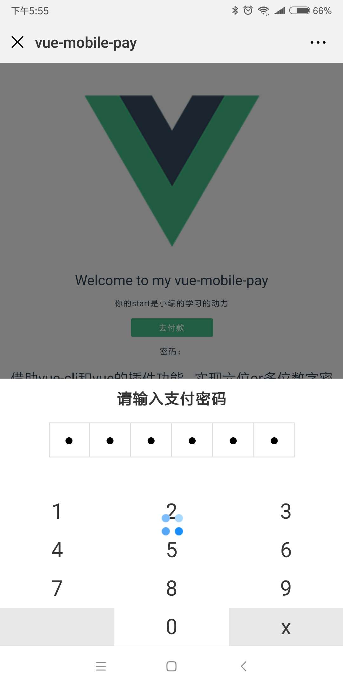
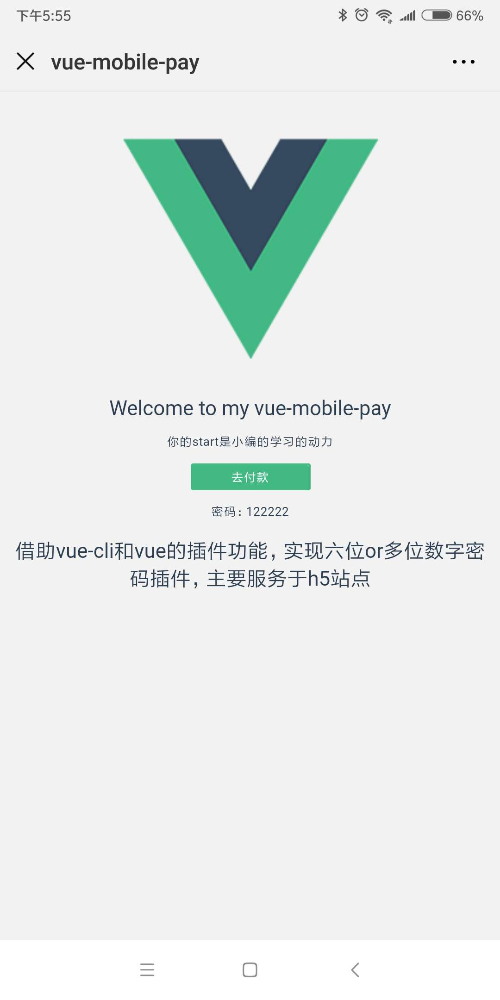
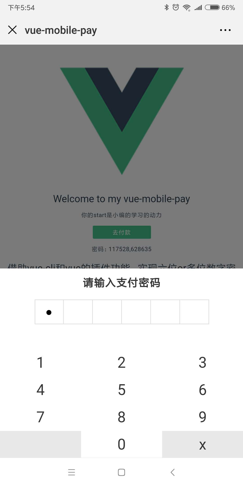
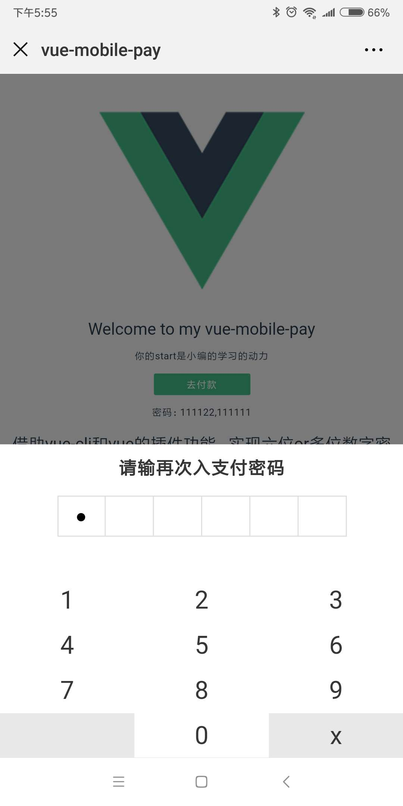

# vue-mobile-pay

> vue h5 支付密码，带数字键盘，且支持再次输入密码做对比，实现方案 

## 使用说明

小编借助vue-cli和vue的插件功能，实现六位或多位数字键盘密码插件，主要服务于移动端

***注意：小编已使用postcss-pxtorem将代码转换为rem，转化基准值为40，请使用者根据实际情况转换，可下载源码，修改.postcssrc.js文件***

## 使用方法

``` bash
import Vue from 'vue'
import vuePayPwd from 'vue-mobile-pay'

Vue.use(vuePayPwd)
```

## 配置

```
<template>
  <div>
    <span class="pay-btn" @click="topay">去付款</span>
    <vue-pay-pwd 
     :isPay="isPay"
     @close = "payClose"
     :is2times = "false"
     :getPassword = "payPw">
    </vue-pay-pwd>
  </div>
</template>
```

```
data () {
    return {
      msg: 'Welcome to my vue-pay-pwd',
      isPay:false,
      pwd:""
    }
  },
   methods: {
      topay(){
        this.isPay = true
      },
      payClose(){
        this.isPay = false
      },
      payPw(pwd){
        this.pwd = pwd.toString()
        console.log(获取密码，pwd)
      }
  },
```

## Props

| name           | Description   | type     | default   | required |
| :------------- | ------------- | -------- | --------- | -------- |
| getPassword    | 拿到一个密码参数，建议必填 | Function | function  | 非        |
| payTitle       | 标题，建议必填       | String   | 请输入支付密码   | 非        |
| pay2Title      | 标题，建议必填       | String   | 请输再次入支付密码 | 非        |
| pwdDigits      | 需要支持几位数密码     | Number   | 6         | 非        |
| highlightColor | 数字键盘带你后高亮色值   | String   | #ccc      | 非        |
| isPay          | 是否显示支付密码      | Boolean  | false     | 必        |
| is2times       | 是否两次输入密码      | Boolean  | false     | 非        |

###展示

一次密码
 



二次密码




感谢您的阅读，[欢迎start](https://github.com/mrhaoxiaojun/vue-mobile-pay.git)一起学习